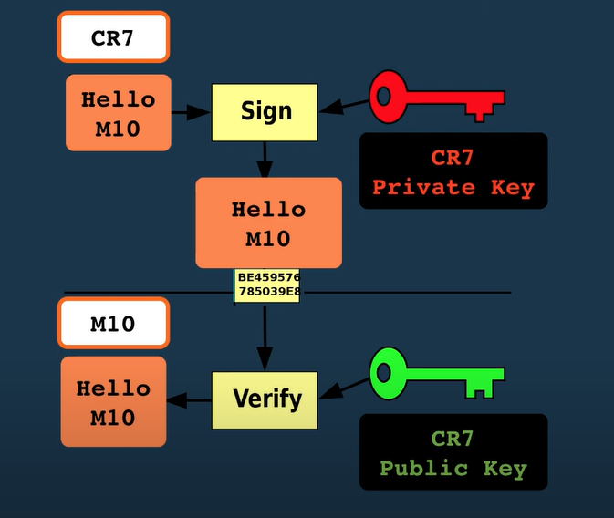

# Danh mục mã trạng thái HTTP

Như bạn có thể thấy bên dưới, mã trạng thái HTTP là các số nguyên có ba chữ số. Chữ số đầu tiên được sử dụng để xác định mã trong một danh mục cụ thể nằm trong năm danh mục sau:

* 1XX - Thông tin: Yêu cầu được chấp nhận hoặc quá trình tiếp tục.
* 2XX - Thành công: Xác nhận rằng hành động đã hoàn tất thành công hoặc đã được hiểu.
* 3XX - Chuyển hướng: Client phải thực hiện hành động bổ sung để hoàn thành yêu cầu.
* 4XX - Lỗi từ client chỉ ra rằng yêu cầu không thể hoàn thành hoặc chứa cú pháp sai. Mã lỗi 4xx sẽ hiện ra khi có lỗi từ phía người dùng, chủ yếu là do không đưa ra một yêu cầu hợp lệ.
* 5XX - Lỗi từ phía máy chủ: Cho biết máy chủ không thể hoàn tất yêu cầu được cho là hợp lệ. Khi duyệt web và bắt gặp các lỗi 5xx, bạn chỉ có thể chờ đợi, vì lúc này lỗi xuất phát từ phía máy chủ của dịch vụ web, không có cách nào can thiệp để sửa lỗi ngoài việc ngồi chờ bên máy chủ xử lý xong

## Danh sách file đã tác động vào trong việc triển khai

  sign-up

* shop.model.js
* routes/index.js
* access/index.js
* access.controller.js
* access.post.http
* access.service.js
* keytoken.model.js
* keyToken.service.js
* authUtils.js
* utils/index.js

  Custom Dynamic Middleware for ApiKey and Permissions

* routes/index.js
* apikey.model.js
* checkAuth.js
* apikey.service.js
* access.post.http
